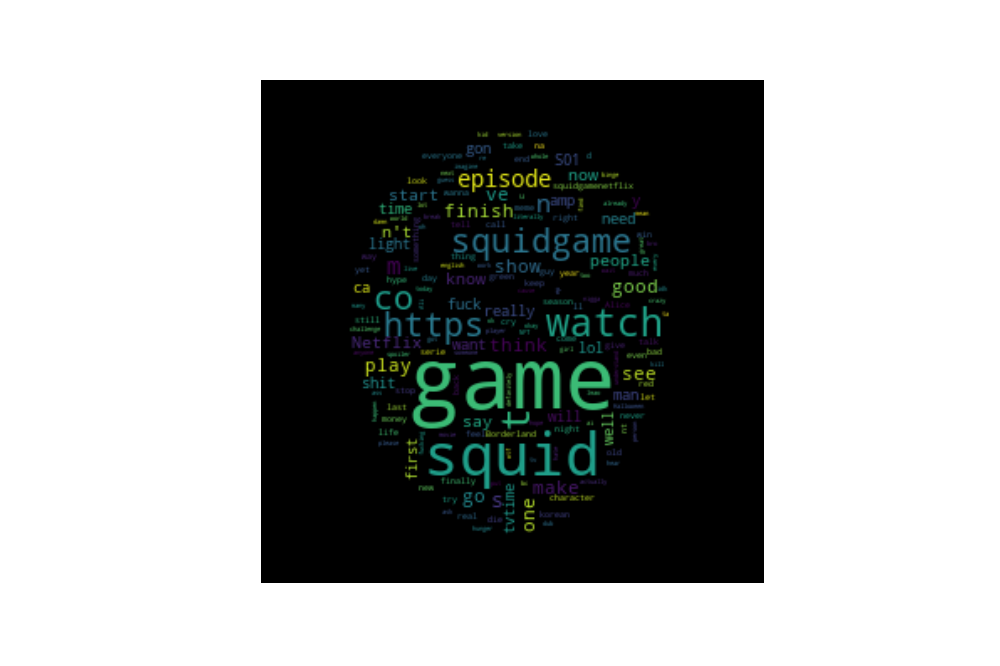

# Tweet Sentiment Analysis

## Description

The mission, if you agree, it's to create a model to identify the sentiments on tweet. And use this model to now the average sentiment on a certain serie.

## Mission objectives

- Be able interact with Twitter's API.
- Be able create a sentiment analysis model.

# Installation

## Python version
* Python 3.9

## Packages used

* pandas
* numpy
* matplotlib.pyplot
* seaborn

* twint
* sklearn
* nltk
* textblob
* spacy
* wordcloud

# Usage
| File                | Description                                                    |
|---------------------|----------------------------------------------------------------|
| main.py         | Main python code|
| /model         | Contain the model|
| /data         | Data file for training and testing the model|
| /utils         | Python libraries for main file|
| /images           | Folder including the plots presented on the Readme |

# The Dataset

We work with 2 dataset:
   * `train_tweets.csv` : This data contain tweet with label, it's use to train the model
   * `SquidGames.csv` : It's the data scrapped from twitter

# Scrapping

To scrap we have use the library twint who's really easy to use. 

At the first time we have try the serie Snowpiercer, but there's not a lot of tweet about it for now, so we switch to SquidGame.

We get to this serie more than 60k tweets.

# Preprocessing

To the preprocessing part we do it on serveral part:
* remove duplicates
* get the authors
* remove mentions
* detect the language because, and keep only english
* tokenization
* remove punctuation
* lemmatization

# Model

We have train the model with sklearn, countvectorizer. And here is the result of this model

### Classification report
   
                  precision    recall  f1-score   support

         0            1.00      0.95      0.97      6300
         1            0.21      1.00      0.35        93

    accuracy                              0.95      6393
    macro avg         0.61      0.97      0.66      6393
    weighted avg      0.99      0.95      0.96      6393

### Confusion matrix
| |True | False
:-----------:|:-----------:|:-----------:
True|5956|344
False|0|93|

### Accuracy
0.9461911465665571

# Conclusion

